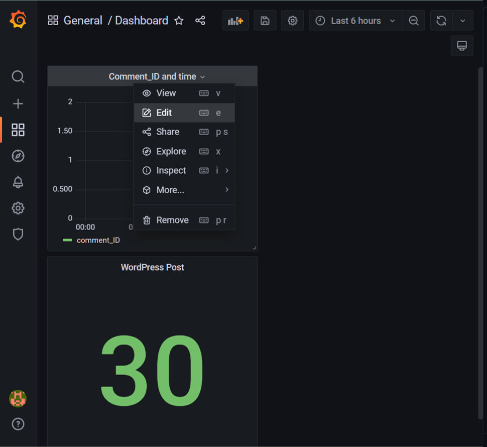
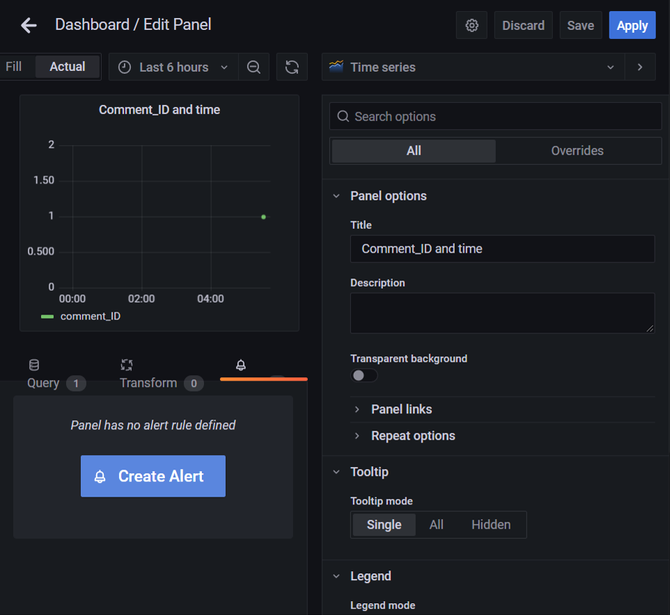
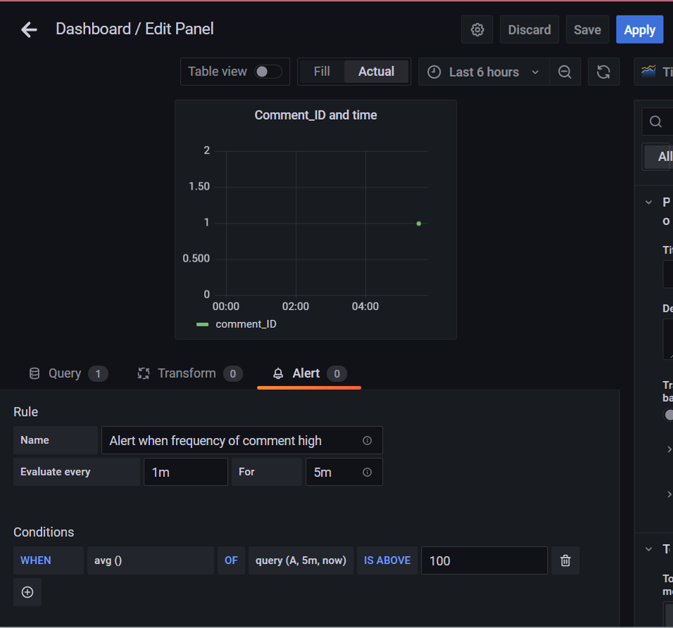
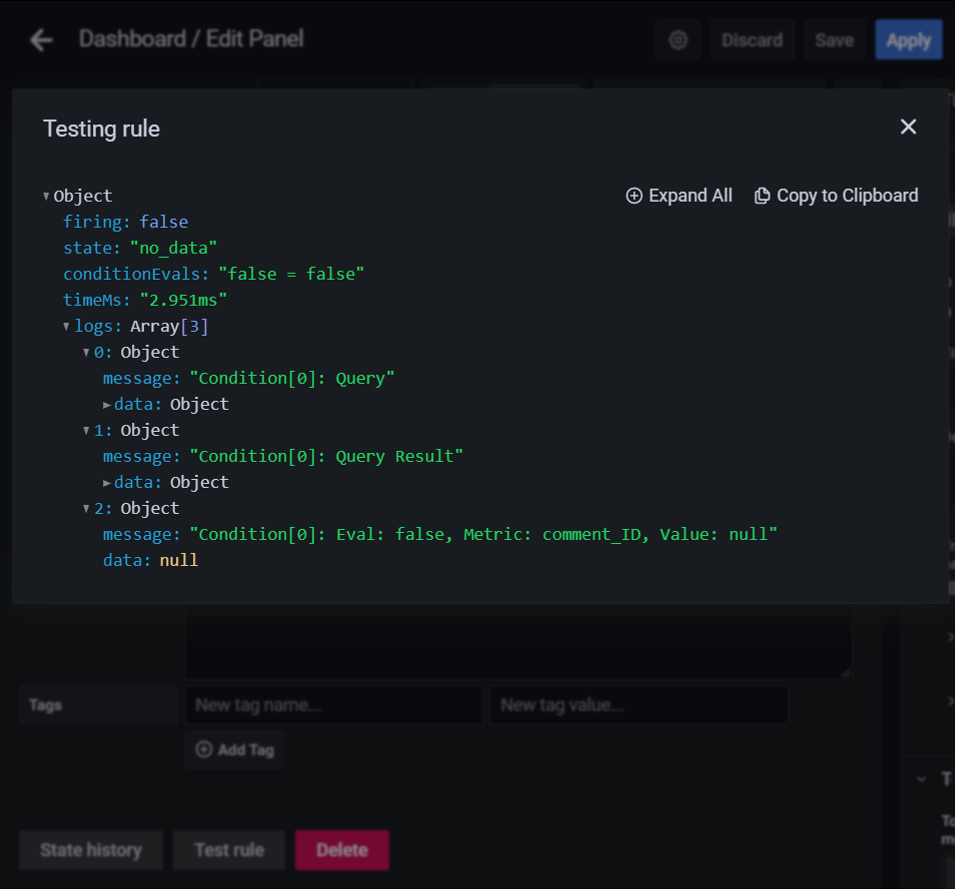

# Step 3: Grafana Alert
Grafana alerting allows you to attach rules to your dashboard panels. When you save the dashboard, Grafana extracts the alert rules into a separate alert rule storage and schedules them for evaluation.

The alerting engine publishes some internal metrics about itself. You can read more about how Grafana publishes internal metrics. See also, View alert rules and their current state.
| Metric Name |     Type    |   Description   |
| ----------- | ----------- | --------------- |
| alerting.alerts | gauge  |How many alerts by state|
| alerting.request_duration_seconds | histogram  |Histogram of requests to the Alerting API|
|alerting.active_configurations|gauge|The number of active, non default alertmanager configurations for grafana managed alerts|
|alerting.rule_evaluations_total|	counter|The total number of rule evaluations|
|alerting.rule_evaluation_failures_total|counter|	The total number of rule evaluation failures|
|alerting.rule_evaluation_duration_seconds|summary|	The duration for a rule to execute|
|alerting.rule_group_rules|	gauge|	The number of rules|

#### Create a Grafana alert
In the Alert tab of the graph panel you can configure how often the alert rule should be evaluated and the conditions that need to be met for the alert to change state and trigger its notifications.

1. Navigate to the panel you want to add or edit an alert rule for, click the title, and then click **Edit**.

2. On the Alert tab, click **Create Alert**. If an alert already exists for this panel, then you can just edit the fields on the Alert tab.

3. Fill out the fields. Step 1,add the rule name, type, and storage location. Step 2, add queries and expressions to evaluate. Step 3, add conditions. For instance, create an alert for frequency of comment is high.
  - In **Rule name**, add a descriptive name. This name is displayed in the alert rule list. It is also the `alertname` label for every alert instance that is created from this rule.
  - For each expression, select either **Classic condition** to create a single alert rule, or choose from **Math, Reduce, Resample** options to generate separate alert for each series
  - For Evaluate every, specify the frequency of evaluation. Must be a multiple of **10** seconds. For examples, `1m`, `30s`.
  - Assign the notification would send to who and draft the message to be send.

  
 4. Select **Test the rules** to make sure the rule return as the expectation.

 
 Create alerting rules can detect respond incident effectively 
